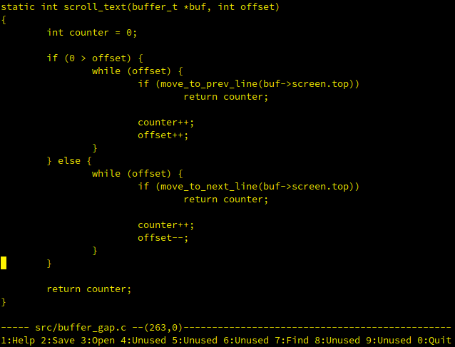

gul - The one true GUL editor!
==============================

First attempt at writing an editor.  Small useful and gul (Swedish for
yellow).  Something that can run on Spectravideo, Atari ST, Amiga 500 as
well as regular PC's, bizarre workstations, or embedded devices.

Screenshot
----------

 
*Fig. 1: Gul in action*

History
-------

First steps made back in 1998 on HP-UX 10.20 from a Windows NT 4.0
Workstation using Exceed and XDM-login on one of the HP PA-RISC servers
at work (ABB).

Development continued at home in Red Hat GNU/Linux on a simple old
PentiumOverdrive which later got upgraded to a Cyrix 6x86 166 MHz, which
in turn now only works as server to my PII @300MHz Laptop.  Still using
Red Hat though ...

Parallell testing done in Solaris at the student body, SdU, using a wide
range of Sun SPARC IPX's SparcStation 2, SPARC 10's.  Testing have also
begun on our SparcStation ELC's.

That was way back in 1998, now it is 2004 and we sit here with AMD
Athlon's running around 2.0 GHz and finally we've picked up the pace at
developing GUL.  Currently we actually have a working release that is
around 14kB in size.

Running
-------

The editor runs best in a `TERM=linux` environment but have also been
tested in xterm-windows. The only keys working as of 1999-03-27 is
cursor-keys and delete. Everything else is pretty much untested.

**Added:** native vt100 interface.  slang support.  new editor core
based on buffer-gap.

Bugs
----

Plenty.  Fix them and send pull request at GitHub :P

To debug, `configure --enabled-debug` and a trace will be written to
`gul.log`. See the source for more info, as usual.

Files
-----

- `doc/README.md`: Random thoughts
- `doc/TIPS`: Some hints on what to do when the going gets tough
- `doc/TODO`: A list of things that needs attention.
- `doc/ChangLog`: A list of things that already have been done.
- `README.md`: This short intro.

License
-------

    Copyright (c) 2004-2015  Joachim Nilsson
    Copyright (c) 1998-2000  Joachim Nilsson, Jakob Eriksson, Anders Bornäs
    
	Permission to use, copy, modify, and/or distribute this software for any
	purpose with or without fee is hereby granted, provided that the above
	copyright notice and this permission notice appear in all copies.
	
	THE SOFTWARE IS PROVIDED "AS IS" AND THE AUTHOR DISCLAIMS ALL WARRANTIES
	WITH REGARD TO THIS SOFTWARE INCLUDING ALL IMPLIED WARRANTIES OF
	MERCHANTABILITY AND FITNESS. IN NO EVENT SHALL THE AUTHOR BE LIABLE FOR
	ANY SPECIAL, DIRECT, INDIRECT, OR CONSEQUENTIAL DAMAGES OR ANY DAMAGES
	WHATSOEVER RESULTING FROM LOSS OF USE, DATA OR PROFITS, WHETHER IN AN
	ACTION OF CONTRACT, NEGLIGENCE OR OTHER TORTIOUS ACTION, ARISING OUT OF
	OR IN CONNECTION WITH THE USE OR PERFORMANCE OF THIS SOFTWARE.
    ~
    ~
    ~
    ~
    "README" 107 lines, 3436 characters written
